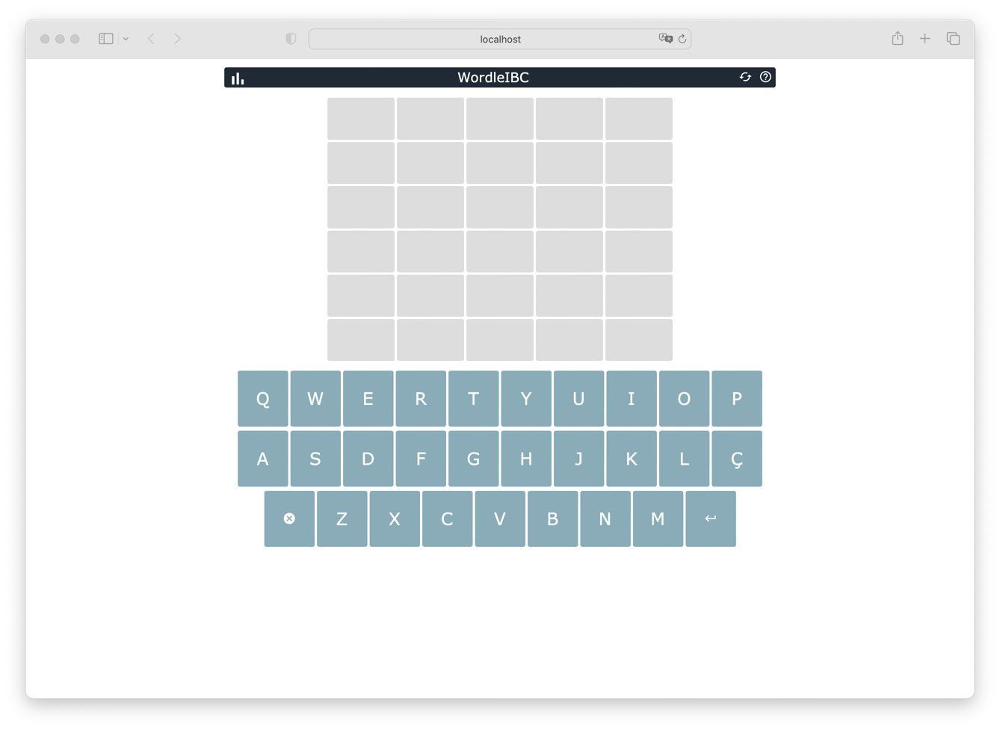

# WordleIBC

Wordle es un juego que consiste en adivinar una palabra de cinco letras en un número limitado de intentos. El juego proporciona una palabra al azar y el jugador debe adivinarla a través de sugerencias y conjeturas. Después de cada intento, el juego proporciona retroalimentación en forma de letras correctas e incorrectas, lo que ayuda al jugador a reducir las posibilidades de las letras correctas.

El objetivo del juego es adivinar la palabra correcta en el menor número de intentos posibles. A medida que el jugador adivina correctamente las letras, se vuelven verdes en la pantalla, lo que indica que están en la posición correcta. Las letras que son correctas pero están en la posición equivocada se muestran en amarillo, lo que ayuda al jugador a determinar qué letras pertenecen a la palabra correcta.

Wordle es un juego divertido y adictivo que pone a prueba la habilidad de adivinación y el conocimiento del jugador sobre las palabras de cinco letras en inglés. Es un pasatiempo popular en línea y puede ser jugado en cualquier dispositivo con conexión a internet.

